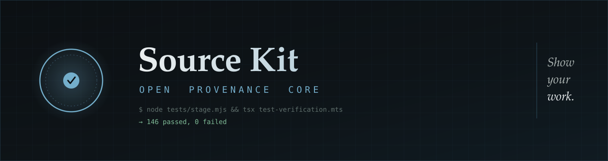

<p align="center">
  
</p>

<p align="center">
  <a href="LICENSE"></a>
  <a href=".github/workflows/ci.yml"></a>
  
  
  &nbsp;<a href="https://testflight.apple.com/join/cRuRw2MN"><b>Try it on TestFlight →</b></a>
  &nbsp;<a href="https://noah-pi.github.io/sourcekit-open/"><b>Deep dive →</b></a>
</p>

---

# Fuck deepfakes. Prove your work.

**Source Kit is a cryptographic camera app that embeds each photo and video with a signed
record of how it was made** — which device, which instant, what the sensors read, what a
second lens saw — so anyone can check later where a file came from and what has happened to
it since.

The record is signed and sealed into the file at the moment of capture, as a standard C2PA
manifest. It works without a network, and it can be checked with any C2PA tool.

**Download the beta:
[testflight.apple.com/join/cRuRw2MN](https://testflight.apple.com/join/cRuRw2MN)** ·
[Deep dive →](https://noah-pi.github.io/sourcekit-open/)

Secure Enclave and App Attest need real hardware. The simulator falls back to a software key
and says so.

## An open source proof-of-concept

All of Source Kit's code is published under Apache-2.0. I'm a journalist turned product
designer, not a cryptographer or a career engineer. Everything is here — camera,
cryptography, native modules, interface, test suite.

## What it commits

All of it optional, all of it switchable in the viewfinder, all of it readable by any C2PA tool.

<details>
<summary><b>Hardware attestation</b> — proof the key is held somewhere you cannot reach into</summary>

This would be much stronger on a Pixel 10, where the signing key is generated inside the Titan
M2, never leaves it, and the phone proves as much to the certificate authority at enrollment. On
Apple the best available is App Attest, which certifies that a genuine iPhone is running an
unmodified build of this app — and then hands the app no access at all to the key it just
attested.

The two get tied together with a commitment. The attestation's `clientDataHash` is set to
`SHA256(challenge ‖ signingPublicKey)`, which pins Apple's certificate to this exact key rather
than to some key on some genuine device. The binding rides inside every manifest and re-checks
offline years later. [appAttest.ts](https://github.com/noah-pi/sourcekit-open/blob/main/src/lib/appAttest.ts)

</details>

<details>
<summary><b>Independent timestamping</b> — time runs one way, which is what makes it provable</summary>

Time is the rare claim that can be proved rather than asserted, because it only moves forward.
Nobody can place a digest in a Bitcoin block mined before the file existed, and no timestamp
authority will countersign something it has not yet been shown. That one-way property is the
whole mechanism.

So a capture carries an RFC 3161 countersignature — verified cryptographically on device rather
than read off the token — and an OpenTimestamps receipt that lands the record's digest in a
block. Newer hardware does this without leaving the phone: the Pixel 10 runs a timestamp
authority on the device itself, so a capture made in airplane mode still carries trusted time.
Here, offline, the capture signs anyway and names the anchor it is missing.
[timestamp.ts](https://github.com/noah-pi/sourcekit-open/blob/main/src/lib/timestamp.ts) ·
[ots.ts](https://github.com/noah-pi/sourcekit-open/blob/main/src/lib/ots.ts)

</details>

<details>
<summary><b>Organizational credentials</b> — optional. the only thing that can attach a name to a key</summary>

A self-signed device key proves consistency and nothing about who you are, and nothing inside
the file can fix that. An organization can, by issuing a certificate for the device's public key
— which never requires the private key to leave the Secure Enclave. Every signature then chains
into the newsroom instead of into itself.

There is a hands-off version: an organization publishes a static document at `/.well-
known/sourcekit-org.json` listing member fingerprints and their certificates, and a member
enters the domain rather than passing files around.

Revocation stays with the organization's CA, over the OCSP and CRL endpoints in the certificates
it issues, so any verifier can ask. A credential that no longer matches the active device key is
ignored and flagged. [orgCert.ts](https://github.com/noah-pi/sourcekit-open/blob/main/src/lib/orgCert.ts)

</details>

<details>
<summary><b>A verdict that refuses to be a badge</b> — four questions, four answers, no checkmark</summary>

A checkmark borrows the authority of whoever supposedly did the checking, and there is nobody
here to borrow from. So the result is four questions, each answered on its own evidence:

Each rung reads *reached*, *not reached*, *failed*, or *not applicable*, and the unreached ones
say why. Unsigned renders neutral grey rather than red, because the absence of a credential is
not evidence of tampering. *Verified*, *authentic* and *trusted* all name a conclusion somebody
reached, so a test fails the build if any of them turns up in a verdict position.
[trustLadder.ts](https://github.com/noah-pi/sourcekit-open/blob/main/src/lib/trustLadder.ts)

- **Media unchanged since signing.** The signature verifies and the bytes match what was signed.
- **Signer identified.** Something outside the file vouches for the key — a signed roster or a curated trust list.
- **Key attested by Apple hardware.** Apple certifies the key is Enclave-resident on genuine hardware.
- **Time bracketed by an independent anchor.** A pinned-authority countersignature or a verified Bitcoin anchor.

</details>

<details>
<summary><b>Privacy and data redaction</b> — a record of the photograph is also a record of the photographer</summary>

Because the record is sealed at the shutter, it documents where the photographer was standing,
when, on which device, and sometimes under what name. For most work that is a credential. For
someone photographing a police stop, a picket line or a border crossing, the same file is a
piece of evidence about them, carried in voluntarily and impossible to recall once shared.

So the choosing happens before the shutter, not on export. Every field is committed under its
own salt into a signed Merkle tree, which lets a verifier tell three states apart:
**disclosed**, **withheld** — committed but absent, with no ciphertext to attack — and **never-
recorded**, declared at capture and bound into the root, so a withheld field cannot later be
passed off as one that was never collected.

Reveal a field later and it still verifies against the original signature. Destroy the seed and
the withheld fields become permanently underivable by anyone, including me. What none of it
covers is the picture itself: blur a face and the signature breaks.
[src/disclosure](https://github.com/noah-pi/sourcekit-open/tree/main/src/disclosure)

</details>

<details>
<summary><b>A second lens</b> — a second viewpoint, sealed in the same file</summary>

Because the second camera is already there and already running, it costs almost nothing to seal.
Source Kit seals a simultaneous downsampled ultra-wide frame into the same file, as a C2PA
ingredient with relationship `componentOf`. Open the photo in any C2PA reader and the second
viewpoint is there.

An ultra-wide sees far more of the room than the frame you composed. A monitor bezel, the edge
of a laptop, the glow off an OLED panel — all of it lands in the second view.

Past that, the geometry. Two lenses a known distance apart see a flat plane identically and a
scene with real depth differently, and no homography removes the difference. On an iPhone Pro
they sit [about 19.2 mm apart](https://arxiv.org/pdf/2506.06037), which is enough to measure
depth out to roughly nine metres from the sealed frame. That is a lot of room, and rephotography
lives at the near end of it: a monitor filling the frame sits about 60 cm away, nowhere near the
limit.

Parallax range calculator

19.2 mm 0.6 m SUBJECT DISTANCE

Disparity = focal length in pixels × baseline ÷ distance, with focal length taken from a 70°
horizontal field of view at the analysed width. A patch has to shift by at least one pixel to be
measurable, so that is the range floor. Below roughly 9 cm the shift exceeds the ±14 px search
window and matching fails outright.

The card reports the matched-patch count and the median disparity, and leaves the reading to
you. [MultipleLensCard.tsx](https://github.com/noah-pi/sourcekit-open/blob/main/src/components/forensic/MultipleLensCard.tsx)

There is an interactive range calculator for this on the [page](https://noah-pi.github.io/sourcekit-open/#glance-sec).

</details>

<details>
<summary><b>The motion of your hand</b> — nobody holds a phone still, and the wobble is specific</summary>

A window of gyroscope and accelerometer samples from around the shutter rides in the record.
Hand tremor over a second or two is unglamorous and highly particular, and a generator does not
produce it by accident.

On a video or a burst — an option in the viewfinder — that trace is drawn against the optical
flow of the frames themselves, so the movement the device felt is checked against the movement
it saw. Two sensors on two different physical principles, obliged to tell the same story.
[poseTrace.ts](https://github.com/noah-pi/sourcekit-open/blob/main/src/provenance/poseTrace.ts)

</details>

<details>
<summary><b>Which way the phone was pointing</b> — sensor readings the picture itself can contradict</summary>

The device knows which way is down from gravity, and where it was aimed from the fused attitude
at the shutter instant. Both predict something visible in the frame: where the horizon should
sit, and — with the signed time and place — which way shadows should fall.

None of this reads the content of the picture. It looks for agreement between what the sensors
claimed and what the frame shows. A recapture of a screen inherits the screen's horizon rather
than the phone's.

Any one of these values can be spoofed alone. They are useful together: a forgery has to satisfy
all of them at once, which is a much harder thing to arrange than any single one. It is a cost
rather than a wall, and it is the kind of cost that falls as generative systems get better at
physical consistency. [context.ts](https://github.com/noah-pi/sourcekit-open/blob/main/src/sensors/context.ts)

</details>

<details>
<summary><b>A raw audio master</b> — compression discards exactly what makes audio checkable</summary>

Because delivery codecs throw away whatever the ear will not miss, they also throw away what
forensic work needs. So alongside the compressed track, an uncompressed 16 kHz master is
converted from the same native buffers and its hash signed into the record.

The best-known use is the mains hum. Grids run at 50 or 60 Hz and drift in a pattern that is
shared across a whole region and never repeats, so indoor audio carries a rough timestamp nobody
can forge without the grid's own history. Matching against a grid database conventionally wants
[ten minutes or more](https://www.sciencedirect.com/science/article/pii/S2352864823000226) of
continuous audio; getting there on shorter clips is an open research problem.

The more interesting direction is agreement between channels. The same grid frequency that
modulates the hum also modulates the light — fluorescent and LED fixtures flicker at twice the
mains rate — so the flicker measured in the picture and the hum measured in the sound are two
readings of one physical quantity. A track dubbed in later has no particular reason to agree
with the room it is supposed to have been recorded in. That comparison is a live research area
rather than a shipped check, and Source Kit does not yet test audio-visual sync itself.
[capture-kit](https://github.com/noah-pi/sourcekit-open/tree/main/modules/capture-kit)

</details>

<details>
<summary><b>Forensic checks any person can run</b> — physics the signed record has to agree with</summary>

A signed timestamp is not only a number. It constrains what the scene is allowed to look like:
the sun's elevation and azimuth are deterministic from a time and a place, so a low sun and a
noon timestamp do not add up. The card draws where shadows should fall and lets you compare. The
committed gyro predicts where level sits in the frame. The motion trace is drawn against the
optical flow.

Nothing here returns a score. A detector gives a number nobody can audit, and it gets worse
exactly as generators improve; this inverts the arrangement, rendering the signed claims against
independent physical expectations and leaving the judgment to a person. A check that could not
run says so. [src/components/forensic](https://github.com/noah-pi/sourcekit-open/tree/main/src/components/forensic)

</details>

<details>
<summary><b>A post-quantum signature</b> — cheap now, and photographs get read decades later</summary>

Every record carries an ML-DSA-65 signature over the same commitment as the ECDSA one.

It is a bank vault door on a garden shed, and worth fitting anyway. The elliptic-curve signature
is nowhere near the weakest thing here, and anyone with a quantum computer would still find it
easier to point a camera at a screen. But the cost is a few kilobytes and a library that already
exists, and a photograph taken this week might be read in a hearing or an archive in twenty
years — by which time the signature protecting it could be the one part that has quietly stopped
meaning anything. Nobody gets to re-sign the archive later. [pq.ts](https://github.com/noah-pi/sourcekit-open/blob/main/src/lib/pq.ts)

</details>

<details>
<summary><b>Works without a network</b> — sealing and verifying both, with the radio off</summary>

No accounts, no analytics, no launch-time network calls, and no registry address bundled in the
app. The optional calls that exist — a timestamp authority, a Bitcoin anchor, an organization
directory you host — are named individually in the docs, and a capture made offline signs anyway
and says which anchors are missing.

Apple's Reference Image sends the raw image, sensor signatures and hardware identifiers to
Private Cloud Compute and returns an authenticated copy. That is a reasonable trade for most
people, and not available to someone who cannot afford to be seen talking to a server.
[NETWORK.md](https://github.com/noah-pi/sourcekit-open/blob/main/docs/NETWORK.md)

</details>

## Chasing instruments of truth

A photograph has never been proof. It has only ever been expensive to fake.

In July 1917 two girls in the Yorkshire village of Cottingley photographed some fairies at the
bottom of the garden. The images were examined by Arthur Conan Doyle, who found them persuasive,
and by Kodak, which declined to certify them but conceded it could not prove them fake. The
fairies were cardboard, copied from a children's book and held up with hatpins. What is striking
about the Cottingley affair is not that anyone was fooled but that the question was already
understood to be a technical one, a matter for Kodak, rather than a question about two girls and
a hatpin.

Retouching is as old as the negative. At Gettysburg in 1863, Alexander Gardner's team [carried a
dead soldier seventy yards](https://www.loc.gov/static/collections/civil-war-glass-negatives/articles-and-essays/does-the-camera-ever-lie/the-case-of-the-moved-body.html) and
propped a prop rifle beside him to make a better picture. Soviet censors [airbrushed the
disgraced out of group portraits](https://en.wikipedia.org/wiki/The_Commissar_Vanishes) for
fifty years before Photoshop shipped in 1990. Back then a convincing lie took a darkroom, a
skill and an afternoon, and it was picture desks, wire services and libel law that made it all
the more expensive to attempt.

Generative models did not make images forgeable. They made forgery fast and essentially free,
which is lighter fluid on an already smouldering sense of reality.

### Legislatures reached for two mechanisms, and both are now law

Forty-nine states have passed [at least one deepfake
statute](https://news.ballotpedia.org/2026/07/30/49-states-have-passed-at-least-one-deepfake-law-since-2019/) since 2019 — 244 of them enacted, 58 in 2026 alone — and forty-eight now cover
sexually explicit deepfakes, thirty-three political ones. The [EU AI Act's Article
50](https://artificialintelligenceact.eu/article/50/) became applicable on 2 August 2026,
requiring machine-readable marking of AI output and a visible label on deepfakes. [California's
AI Transparency
Act](https://leginfo.legislature.ca.gov/faces/billTextClient.xhtml?bill_id=202320240SB942) took
effect the same day, China has required labelling of synthetic media since its deep synthesis
rules, and South Korea and Denmark have moved on likeness and consent.

The pattern is not American. The [EU AI Act's Article
50](https://artificialintelligenceact.eu/article/50/) became applicable on 2 August 2026,
requiring machine-readable marking of AI output and a visible label on deepfakes, with penalties
up to €15 million or 3% of global turnover. [California's AI Transparency
Act](https://leginfo.legislature.ca.gov/faces/billTextClient.xhtml?bill_id=202320240SB942) took
effect the same day. China has required labelling of synthetic text, image, audio and video
since its deep synthesis rules, South Korea criminalised sexual deepfakes without an intent-to-
distribute test, and Denmark has moved to treat a person's face and voice as their property. The
mechanisms diverge; the two technical demands underneath them do not.

### 1 / Requiring invisible watermarks on generated media

A watermark rides inside what a model generates, and it holds up against ordinary handling. It
does not hold up against effort. Regenerating an image through a diffusion model [strips the
mark and keeps the picture](https://arxiv.org/abs/2408.10446), one watermark can [overwrite
another](https://arxiv.org/abs/2605.16796), and there is [tooling for it on
GitHub](https://github.com/guillaumemeyer/watermarks-remover). Open-weight models emit nothing
to strip in the first place. Detection has the same shape of problem: a classifier chasing a
generator gets worse exactly as the generator improves.

The deeper limit is that a watermark can only speak for what a machine made. It says nothing
about a photograph, which leaves the person holding real footage with nothing to show. Once
everyone knows video can be faked, real video gets dismissed as fake — a move already run in
court by [Tesla's lawyers over recordings of Elon Musk](https://fortune.com/2023/04/27/elon-musk-lawyers-argue-recordings-of-him-touting-tesla-autopilot-safety-could-be-deepfakes/) and by
[January 6th defendants over footage from inside the
Capitol](https://btlj.org/2025/06/deepfaked-evidence-what-case-law-tells-us-about-how-the-rules-of-authenticity-needs-to-change/).

### 2 / Requiring all media to carry tamper-proof data about its provenance

Provenance is a word borrowed from the art trade, where it means the paper trail of a painting's
owners — the chain of receipts, bills of sale and catalogue entries that says where a canvas has
been since it left the studio. It was never a claim about the painting. A perfect provenance on
a forgery is a well-documented forgery, and the trade has bought plenty of those. What the paper
trail does is make lying laborious, because the liar has to manufacture a history rather than an
object.

The digital version is the same idea with a signature instead of a filing cabinet. Adobe, Arm,
the BBC, Intel, Microsoft and Truepic founded the [Coalition for Content Provenance and
Authenticity](https://c2pa.org/) in February 2021, and the first specification followed a year
later. Instead of examining a file for signs of forgery, seal it at the source so any later
change reads as a change. A watermark says a machine was involved. A manifest says which device,
which moment, and what has happened since.

## From bytes to photons

Between the sensor and the signature there is a stretch of code. How long it is decides what the
signature is worth.

*Roughly thirty milliseconds separate the photons from the pixels, and every stage of it runs
before any third-party app is handed anything. A Pixel 10 signs at **A**. Source Kit signs at
**B**.*

A photograph starts as charge on a grid of sensor wells and ends as a file. Everything in
between — demosaic, lens correction, noise reduction, tone-map, encode — is code that could hand
the next stage a different picture. What a signature proves has less to do with the key than
with how much of that chain stands between the photons and the signing.

[C2PA grades signers on two levels](https://github.com/c2pa-org/conformance-public): keys
protected in software, or keys in hardware with a live attestation from the silicon. The [Pixel
10](https://blog.google/security/pixel-android-trusted-images-c2pa-content-credentials/) is the
first phone to reach the second, signing inside the imaging pipeline with the key in the Titan
M2 — the frame never passes through general-purpose code, so there is no seam where another
image could be substituted. Qualcomm has the same idea in the Snapdragon secure environment.
(Dedicated cameras got here first, starting with Leica in 2023; this is a smartphone story now.)

Source Kit sits at the far end. It signs the bytes the operating system hands it, with a key in
the Secure Enclave, and can attest to nothing upstream of that hand-off. That is the ceiling for
a third-party app on iOS, which is why it commits more *around* the frame rather than claiming
more about it.

## Where it still comes up short

Six ways a file can carry a perfect signature and still mislead you. The first independent
security review of the specification, [Golaszewski et al. at
UMBC](https://eprint.iacr.org/2026/804), found implementation problems on top of these —
disagreeing validators, weak revocation, an exclusion range that hides edits. Those are fixable.
The six below are structural.

`REPHOTOGRAPHY` · *partially addressable*

**The lens can be pointed at a screen.** Photograph a good monitor and every guarantee holds,
because all of them are true: the sensor did see those photons. No signature reaches past the
front of the lens.

`SENSOR SPOOFING` · *partially addressable*

**A signature binds a claim without checking it.** Civilian GPS is unauthenticated and spoofers
cost less than a phone. The scene is real, the signature is valid, and the place is wrong —
sealed just as faithfully as a true one.

`METADATA STRIPPING` · *addressable*

**Most platforms strip the credential on upload.** The manifest disappears the moment a picture
starts to travel, and a stripped file is indistinguishable from one that was never signed. The
answer is a fingerprint plus a lookup service. The fingerprint exists here; the lookup does not.

`SOFTWARE INJECTION` · *addressed in new devices*

**Below Level 2, a picture can be handed to the signer.** If the frame reaches the signer
through code nobody attested to, whatever arrives gets signed correctly. A researcher did this
to the Nikon Z6III through its multiple-exposure mode; Nikon invalidated every certificate it
had issued.

`STAGED REALITY` · *no viable solution*

**A staged scene is a true photograph of a lie.** Everything here would have sealed the
Cottingley fairies without complaint. Real camera, real garden, real light, real distance — two
lenses would measure genuine depth, because there was genuine depth. Every check passes, and
every one is telling the truth.

`REDACTION` · *addressable*

**Protecting someone in the frame breaks the proof.** Blur a bystander's face or crop a landmark
and the signature fails, giving the same verdict a forgery gets. Selective disclosure covers the
metadata, so fields can be withheld and still verify. Nothing yet covers the pixels.

Everything this app commits is aimed at raising what a forger has to hold consistent at once —
geometry, motion, shadows, time — and most of it at the first gap, which stays open however good
the hardware gets.

## The danger in a permanent record of everything

A file that can prove where it came from can also prove where you were. The tension is real and
it does not resolve — it gets decided, capture by capture.

A wedding photographer wants every field filled in. A photographer at a protest wants the frame
and nothing else: the same GPS fix that corroborates a story for a picture desk will place a
named person at a named corner on a named afternoon, and once the file is shared it cannot be
recalled. A newsroom byline that vouches for one photograph identifies that photographer in
every other one they sign. There is no setting that is correct for both, which is why each of
these is switchable in the viewfinder rather than chosen once.

## The shutter path

Six things happen on the device before the file exists.

| | | |
|---|---|---|
| 1 | **Hash the exact bytes.** SHA-256, chunked, so verifying a video never loads it whole. | `src/lib/fileHash.ts` |
| 2 | **Record what the sensors said.** Time, GPS (opt-in), heading, barometric altitude, a motion signal. | `src/sensors/` |
| 3 | **Sign in the Secure Enclave.** ECDSA P-256. The key is generated on the chip and can't leave it; signing happens there, not in app memory. | `src/lib/deviceKey.ts`, `modules/secure-enclave/` |
| 4 | **Write Content Credentials into the file.** A real C2PA manifest — CBOR claim, hard binding, COSE_Sign1 — inside the JPEG, PNG, MP4, MOV or M4A. CI checks on every run that `c2patool` reads it. | `src/c2pa/` |
| 5 | **Sign it again, post-quantum.** ML-DSA-65 over the same commitment, so a future break of P-256 doesn't quietly invalidate an archive. | `src/lib/pq.ts` |
| 6 | **Anchor the time.** RFC 3161 when there's a network, OpenTimestamps for independent proof-of-existence. Offline it signs without, and says so. | `src/lib/timestamp.ts`, `src/lib/ots.ts` |

Sealing and verifying both work with the radio off. No accounts, no analytics, no
launch-time network calls. Every optional network event is named in
[`docs/NETWORK.md`](docs/NETWORK.md).

## What you can take

Most of it is platform-neutral TypeScript with no build step.

| Path | What it is |
|---|---|
| `src/c2pa/` | A complete, dependency-light C2PA implementation: CBOR claims, COSE_Sign1, JPEG APP11/JUMBF, PNG `caBX`, BMFF/MP4 embedding with chunk-offset repair, and the verifier. Cross-checked against `c2patool` on every CI run. Probably the most reusable thing here. |
| `src/lib/` | Crypto plumbing, pure TS: a strict X.509 chain verifier, RFC 3161 tokens, COSE/DER, ECDSA, the ML-DSA-65 layer, AES-256-GCM, canonical JSON. No WebCrypto, no network. |
| `src/provenance/` | Capture → sealed record: orchestration, schema, background seal queue, detached manifests, and a differential oracle that runs two independent engines against each other and flags disagreement. |
| `src/disclosure/` | Commit every field at capture, reveal them individually later, without breaking the original signature. |
| `src/vault/` | Encrypted storage. Media, records and thumbnails all sealed; plaintext exists only in a cache folder shredded on lock. |
| `src/theme.ts`, `src/components/`, `app/` | The whole interface — tokens, UI kit, screens. |
| `modules/` | The Swift: Secure Enclave keygen and signing, App Attest, the AVFoundation capture engine, the raw-audio sink, the C2PA Rust binding. |
| `server/` | An App Attest relay in one dependency-free file. Run your own or skip it — offline devices sign unattested and say so. |
| `tests/` | 27 suites, 769 checks, run against the real shipping code. |

## Run the lab

```sh
node tests/stage.mjs
cd tests/.staged && npm install
./node_modules/.bin/tsx test-verification.mts     # → 146 passed, 0 failed
```

Staging rewires only device services — keychain, filesystem, device model — to small
shims. Every cryptographic operation is the code that runs on the phone. The suites
sign fresh media with a random key each run, then attack it: flipped bits, transplanted
manifests, a self-issued "O=Reuters" certificate, truncated files, hostile parsers.

With `c2patool` on your path the independent-verifier checks run too. Without it they
report `SKIP` and are counted separately.

## Things I have not built yet

A short list of what looks worth doing next, and why.

- **Android.** The obvious one. StrongBox gets closer to the sensor than the Secure Enclave
allows, and the platform exposes sensors iOS keeps to itself — raw barometric pressure, per-
frame camera timestamps, a real multi-camera API. Anything committed there would be stronger
than the same claim made here.
- **LiDAR.** Pro iPhones ship a depth scanner and nothing uses it for provenance. A depth map
sealed alongside the frame settles the flat-screen question outright at close range, where
parallax is already strongest and rephotography actually happens.
- **Optional face blurring that survives the signature.** Right now protecting a bystander
breaks the seal. A redaction committed at capture — the blur applied before signing, the
original never written — would let someone publish a crowd without publishing the crowd's faces.
- **More ways to catch rephotography.** Moiré from a display's pixel grid, the refresh beat of a
panel against a rolling shutter, the polarisation signature of an LCD. Each is a different
physical tell, and none needs a model.
- **PRNU across several captures.** Every sensor has a fixed noise fingerprint. One frame is
weak evidence; a set of frames from the same device is much stronger, and it is the kind of
check a desk could run over an archive rather than a file.
- **Soft binding, and formats that outlive the file.** The perceptual fingerprint is already
committed; what is missing is somewhere to look it up when a platform strips the manifest. That
is the single most valuable unbuilt thing here.

## Limits

- **Two checks aren't performed:** TSA root anchoring and certificate revocation. Both
  are named on every verification rather than skipped quietly.
- **Sensors are claims.** Time, GPS, heading, altitude are what the device reported,
  bound into the signature. The binding is real; whether the device told the truth is a
  separate question.
- **Stereo capture is unvalidated on iPhone 17 / iOS 26.** The verification side is
  lab-tested. The capture side moved to Apple's virtual dual-wide device graph and I
  haven't confirmed it in the field yet.
- **No conformance certification.** Files carry standard C2PA manifests and `c2patool`
  reads them on every CI run, but nothing here has been through the conformance program.
- **Beta software, written by one person with AI assistance**, and held to account by the
  test lab, an independent reference verifier and the differential oracle — see
  [`docs/PROVENANCE.md`](docs/PROVENANCE.md). Don't keep your only copy of anything
  important in it, and please don't stake anything serious on it without reading the code
  yourself.

## Building it

If you just want to use it, the beta is on
[TestFlight](https://testflight.apple.com/join/cRuRw2MN).

To build it yourself:
[`docs/BUILDING.md`](docs/BUILDING.md). It's an Expo app: `npm install`, then
`npx expo run:ios` on a Mac with Xcode. Secure Enclave and App Attest need a real
device; the simulator falls back to a software key and labels itself as such. Forking
for your own build means replacing the EAS project id in `app.json` and the App Attest
app id in `src/lib/appleAttestRoot.ts`.

## Docs

[Architecture](docs/ARCHITECTURE.md) · [Threat model](docs/THREAT-MODEL.md) ·
[Security](docs/SECURITY.md) · [Integrity](docs/INTEGRITY.md) ·
[Network](docs/NETWORK.md) · [Settings](docs/SETTINGS.md) ·
[Decisions](docs/DECISIONS.md) · [Recovery](docs/RECOVERY.md) ·
[Provenance](docs/PROVENANCE.md)

## License

Apache-2.0 ([LICENSE](LICENSE), with [NOTICE](NOTICE) for attribution that travels).
"Source Kit" is a trademark and isn't licensed for derivative use
([TRADEMARK.md](TRADEMARK.md)) — fork it, ship it under your own name.

If you build something with this, or find something I got wrong, I'd really like to hear
about it.

— Noah Bassetti-Blum
